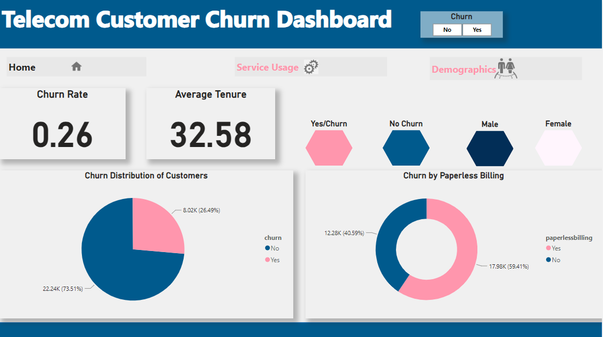

# A Customer Churn Prediction ( Building a Machine Learning Model to Predict Customer Churn)

### 📗 Table of Contents

- [📗 Table of Contents](#-table-of-contents)
- [A Customer Churn Prediction](#a-customer-churn-prediction)
- [Project Description](#project-description)
- [Summary](#summary)
- [EDA](#eda)
- [Introduction](#introduction)
- [Understanding the Data](#understanding-the-data)
- [Business Questions](#business-questions)
- [Hypothesis](#hypothesis)
- [Data Understanding](#data-understanding)
- [Modeling and Evaluation](#modeling-and-evaluation)
- [Hyperparameter tuning](#hyperparameter-tuning)
- [Conclusion](#conclusion)
- [👥 Authors](#-authors)
- [⭐️ Show your support](#️-show-your-support)
- [🙏 Acknowledgments](#-acknowledgments)
- [📝 License](#-license)


---

### Project Description

The primary objective of this project is to develop a classification model for churn analysis to aid in customer retention efforts. Churn analysis focuses on predicting whether customers are likely to leave or continue their relationship with the company. By identifying customers at risk of churning, the company can take proactive measures to retain them, thus increasing revenue and profit margins.

---

### Summary
| Project Code | Project Name | Published Article | Power BI Dashboard |Libraries Used|
|--------------|--------------|-------------------|-----------------|--------------|
| LP2          | Machine <br> Learning <br> Model <br> Customer <br> Churn <br> Prediction| [Medium <br> Article](https://medium.com/@vezabuku/machine-learning-model-to-predict-customer-churn-e38898e9033a) | [PowerBI <br>](https://app.powerbi.com/groups/me/reports/03d945db-e5bc-4c1e-b012-ae97f258e068/ReportSection1b44d3106ed4850200a1?experience=power-bi)|Pandas <br> Numpy <br> Matplotlib <br> Seaborn <br> Sklearn|

---

### Exploratory Data Analysis (EDA)
Exploratory Data Analysis (EDA) plays a vital role in understanding and extracting insights from datasets. It allows us to uncover patterns, relationships, and key characteristics of the data. The main objective of this project is to utilize the CRISP-DM framework as a guiding framework for conducting exploratory data analysis (EDA) and extracting valuable insights. The Cross Industry Standard Process for Data Mining (CRISP-DM) is a process model that serves as the base for data processing.

---

### Introduction

The analysis was performed using the Python programming language and popular libraries such as Pandas, NumPy, Seaborn, Sklearn and Matplotlib. These libraries facilitated various analysis tasks, including examining individual variables, exploring relationships between variables, analyzing correlations, handling duplicate and missing data as well as the modeling process.

The analysis was conducted in a Jupyter Notebook environment, which allowed for an interactive and organized workflow. Standard EDA procedures were followed, including assessing data quality, performing descriptive statistics, and creating visualizations.

The dataset was explored to understand its structure, check for missing or duplicated data, and convert variables to appropriate formats when necessary. Descriptive statistics provided a summary of the data, allowing for an understanding of the central tendencies, variations. Visualizations, such as histograms, kde plots, box plots and scatter plots were created to identify patterns, trends, and relationships between variables. The analysis also involved examining the relationship between churn and other variables to identify key indicators to customer churn.

##### Install Packages

Here, you need to recursively install the packages in the `requirements.txt` file using the command below 

```sh
   pip install -r requirements.txt
```

##### Imported libraries
To begin the analysis, I started by importing the necessary libraries and packages that will be used throughout the process. These libraries include:
- Pandas and Numpy: for data cleaning and manipulation
- Matplotlib, Seaborn and Plotly: for visualizations
- Dotenv: for importing environmental variables
- Mann Whitney and Fishers_exact: for Hypothesis testing
- Sklearn: for Machine Learning packages

---

### Data Understanding

##### 1. Acquisition Process

The analysis involves data from an SQL database (3000 entries), a GitHub repository (2000 records), and a One Drive account (2000 records). These datasets were seamlessly integrated using environment variables for data retrieval. The GitHub and One Drive data, stored as CSV and Excel files respectively, were imported into the analysis environment using Pandas. The data from the One Drive account will be used to test the model, while data from the SQL database and GitHub repository will be used for training the model.

##### 2. Columns in the dataset:

The dataset columns and their descriptions include:

- Gender: Whether the customer is male or female
- SeniorCitizen: Whether a customer is a senior citizen or not
- Partner: Whether the customer has a partner or not (Yes, No)
- Dependents: Whether the customer has dependents or not (Yes, No)
- Tenure: Number of months the customer has stayed with the company
- Phone Service: Whether the customer has a phone service or not (Yes, No)
- MultipleLines: Whether the customer has multiple lines or not
- InternetService: Customer’s internet service provider (DSL, Fiber optic,No)
- OnlineSecurity: Whether the customer has online security or not (Yes, No, No Internet)
- OnlineBackup: Whether the customer has online backup or not (Yes, No, No Internet)
- DeviceProtection: Whether the customer has device protection or not (Yes, No, No internet service)
- TechSupport: Whether the customer has tech support or not (Yes, No, No internet)
- StreamingTV: Whether the customer has streaming TV or not (Yes, No, No internet service)
- StreamingMovies: Whether the customer has streaming movies or not (Yes, No, No Internet service)
- Contract: The contract term of the customer (Month-to-Month, One year, Two year)
- PaperlessBilling: Whether the customer has paperless billing or not (Yes, No)
- Payment Method: The customer’s payment method (Electronic check, mailed check, Bank transfer(automatic), Credit card(automatic))
- MonthlyCharges: The amount charged to the customer monthly
- TotalCharges: The total amount charged to the customer
- Churn: Whether the customer churned or not (Yes or No)

##### 3. Gaining Insights into Data.

By utilizing Pandas functions such as df.shape(), df.head(), df.info(), and df.describe(), I gained a comprehensive understanding of my dataset's structure, content, and potential issues. This insight allowed me to identify initial data cleaning and preprocessing tasks, such as converting boolean values to 'yes' for true and 'no' for false, ensuring a uniform format across all columns. This systematic approach not only helped me define specific problems for analysis but also laid the foundation for deriving meaningful insights and solutions from the data.

---

### Business Questions

1. What is the average tenure of customers who churned compared to those who stayed?
2. Do customers with partners or dependents have a lower churn rate?
3. How does the presence of multiple lines affect customer churn?
4. Is there a correlation between the contract term (Contract) and customer churn?
5. What are the common payment methods (Payment Method) among customers who churned?
6. How does the availability of tech-related services (e.g., OnlineSecurity, TechSupport) impact churn rates?
7. What percentage of customers who churned had streaming services (StreamingTV, StreamingMovies)?
8. Is there a difference in churn rates between senior citizens and non-senior citizens?

---
### Power BI Dashboard



---

### Hypothesis

I developed a hypothesis statement to better help understand the churn behavior in relation to other variable as stated below;

Null Hypothesis (Ho): There is no significant difference in churn rates between customers with shorter and longer tenure.

Alternative Hypothesis (Ha): There is a significant difference in churn rates between customers with shorter and longer tenure.

---

### Modeling and Evaluation

During model training, I utilized six models: Decision Tree, Logistic Regression, KNN, Random Forest, XGBoost, and AdaBoost. I implemented a loop function to streamline the process and created a final pipeline that integrated the preprocessing steps and the classifier. After fitting the pipeline on the x_train and y_train encoded data, I made predictions on the x_eval data.

To evaluate the models, I generated a metrics table from the classification report and sorted it based on the highest F1-score values. Given the data’s imbalance, I opted to assess the model performance using the F1-score rather than accuracy.

---

### Hyper parameter Tuning

Hyperparameter tuning is crucial for optimizing machine learning model performance.

In this project, I applied hyperparameter tuning to the six selected models: Decision Tree, Logistic Regression, KNN, Random Forest, XGBoost, and AdaBoost. Using GridSearchCV with a 5-fold cross-validation strategy, I defined specific parameter grids for each model to search for the best combination of hyperparameters..

---

### CONCLUSIONS

In conclusion, my exploration into predicting customer churn using machine learning models, particularly focusing on the Logistic Regression model, has revealed crucial insights into customer behavior in the telecom industry. The analysis of feature importances shed light on factors that significantly impact customer churn, providing actionable recommendations for businesses to enhance customer retention and satisfaction.


#### 👥 Authors

Adiru Valiant Ezabuku

Email: vezabuku09@gmail.com

Linkedin Account: [Linkedin](https://www.linkedin.com/in/valiant-ezabuku/)

#### ⭐️ Show your support

If you like this project kindly show some love, give it a 🌟 **STAR** 🌟

#### 🙏 Acknowledgments

I extend my heartfelt thanks to all my tutors at Azubi Africa and my dedicated team members for their guidance, support, and hard work throughout this project. Their expertise, insights, and collaboration significantly contributed to shaping the analysis and outcomes.

#### 📝 License

This project is [MIT](./LICENSE) licensed.


